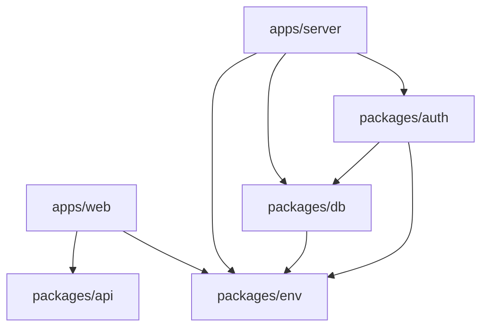
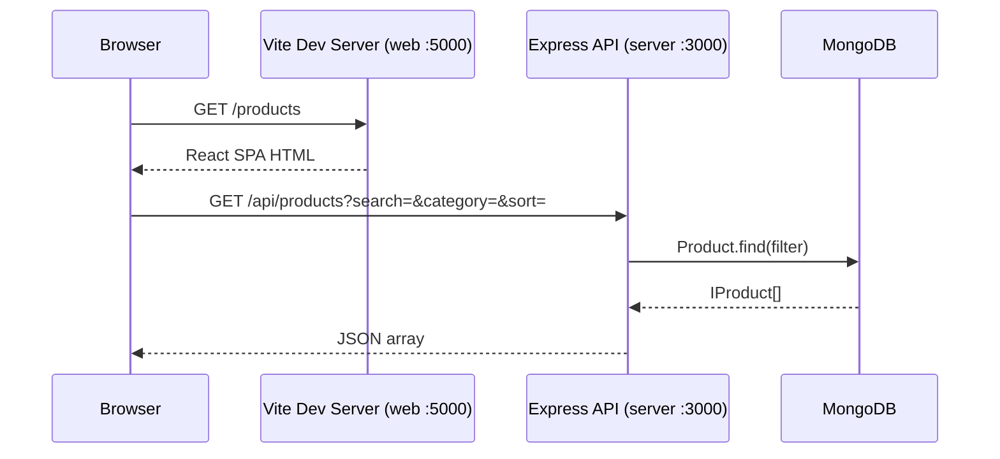

# E-Commerce Web Application — Design Document

## Overview

This document describes the technical design for the E-Commerce Web Application, a full-stack TypeScript monorepo that enables customers to browse products, manage a shopping cart, place orders, and track order history, while giving administrators tools to manage the product catalog and order lifecycle.

The application is built as a Turborepo monorepo with two deployable apps (`apps/web`, `apps/server`) and three shared packages (`packages/api`, `packages/auth`, `packages/db`). The frontend is a React SPA served by Vite; the backend is an Express REST API. Authentication uses JWT tokens stored in `localStorage` and sent as `Authorization: Bearer <token>` headers. Cart state is managed client-side in React Context and persisted to `localStorage`.

---

## Architecture

### Monorepo Structure

```
E-Commerce-Web-Application/
├── apps/
│   ├── web/          # React 19 + Vite + Tailwind + shadcn-ui (port 5000)
│   └── server/       # Express 5 + Zod + Mongoose (port 3000)
├── packages/
│   ├── api/          # ts-rest contract definitions (shared types)
│   ├── auth/         # better-auth server instance
│   ├── db/           # Mongoose models + connectDB
│   ├── config/       # Shared TypeScript / ESLint config
│   └── env/          # Typed environment variable schemas (Zod)
├── package.json      # npm workspaces root
└── turbo.json        # Turborepo pipeline
```

### Package Dependency Graph



### Request Flow



In production, the Vite build output is served as static files (e.g., via Vercel), and the Express server is deployed separately. The frontend proxies `/api/*` requests to the backend URL configured in `VITE_SERVER_URL`.

---

## Components and Interfaces

### Backend Layer Structure

```
apps/server/src/
├── index.ts              # Express app bootstrap, CORS, route mounting
├── middleware/
│   ├── authMiddleware.ts  # JWT verification → req.user
│   ├── adminMiddleware.ts # role === "admin" guard
│   └── errorMiddleware.ts # notFound + global error handler
├── controllers/
│   ├── authController.ts  # register, login, getProfile
│   ├── productController.ts # CRUD + search/filter/sort
│   └── orderController.ts # placeOrder, getMyOrders, getAllOrders, updateStatus
├── routes/
│   ├── authRoutes.ts
│   ├── productRoutes.ts
│   └── orderRoutes.ts
├── models/               # (lives in packages/db, imported here)
└── utils/
    └── generateToken.ts  # jwt.sign wrapper
```

### Frontend Layer Structure

```
apps/web/src/
├── main.tsx              # ReactDOM.createRoot + RouterProvider
├── router.tsx            # createBrowserRouter route tree
├── app-shell.tsx         # AuthProvider > CartProvider > Navbar + Outlet + Footer
├── context/
│   ├── AuthContext.tsx   # user state, login(), logout(), isAdmin
│   └── CartContext.tsx   # cart[], addToCart, removeFromCart, updateQuantity, clearCart
├── services/
│   ├── api.ts            # Axios instance with Bearer token interceptor
│   ├── authService.ts    # register, login, getProfile
│   ├── productService.ts # fetchProducts, fetchProductById, createProduct, updateProduct, deleteProduct
│   └── orderService.ts   # placeOrder, fetchMyOrders, fetchOrderById, fetchAllOrders, updateOrderStatus
├── components/
│   ├── Navbar.tsx        # Top nav with cart badge, user menu, admin link
│   ├── Footer.tsx
│   ├── ProductCard.tsx   # Product thumbnail card used on listing pages
│   ├── ProtectedRoute.tsx # Redirects to /login if !user
│   ├── AdminRoute.tsx    # Redirects to / if !isAdmin
│   ├── Loader.tsx        # Spinner component
│   ├── Message.tsx       # Error/info message banner
│   └── ui/               # shadcn-ui primitives (Button, Card, Input, etc.)
└── pages/
    ├── Home.tsx
    ├── Products.tsx
    ├── ProductDetails.tsx
    ├── Cart.tsx
    ├── Checkout.tsx
    ├── MyOrders.tsx
    ├── OrderDetails.tsx
    ├── Profile.tsx
    ├── Login.tsx
    ├── Register.tsx
    ├── AdminDashboard.tsx
    ├── ManageProducts.tsx
    ├── AddProduct.tsx
    ├── EditProduct.tsx
    └── ManageOrders.tsx
```

### API Endpoints

| Method | Path | Auth | Description |
|--------|------|------|-------------|
| POST | `/api/auth/register` | — | Create account, return JWT |
| POST | `/api/auth/login` | — | Authenticate, return JWT |
| GET | `/api/auth/profile` | User | Get current user profile |
| GET | `/api/products` | — | List products (search, category, sort) |
| GET | `/api/products/:id` | — | Get single product |
| POST | `/api/products` | Admin | Create product |
| PUT | `/api/products/:id` | Admin | Update product |
| DELETE | `/api/products/:id` | Admin | Delete product |
| POST | `/api/orders` | User | Place order |
| GET | `/api/orders/my-orders` | User | Get current user's orders |
| GET | `/api/orders/:id` | User/Admin | Get order by ID |
| GET | `/api/orders` | Admin | Get all orders |
| PUT | `/api/orders/:id/status` | Admin | Update order status |

### ts-rest Contract (`packages/api`)

The `packages/api` package defines the shared contract using `@ts-rest/core`. The current contract will be expanded to cover all routes, providing end-to-end type safety between the Express server and the React frontend via `@ts-rest/react-query`.

```typescript
// packages/api/src/index.ts (target state)
export const contract = c.router({
  auth: c.router({ register, login, profile }),
  products: c.router({ list, getById, create, update, remove }),
  orders: c.router({ place, myOrders, getById, all, updateStatus }),
});
```

Each route definition includes Zod schemas for request body, query params, path params, and all response shapes, ensuring compile-time type safety across the monorepo.

### Route Guards

- **`ProtectedRoute`**: Reads `user` from `AuthContext`. If `null`, renders `<Navigate to="/login" />`.
- **`AdminRoute`**: Reads `isAdmin` from `AuthContext`. If `false`, renders `<Navigate to="/" />`.

---

## Data Models

### User (`packages/db/src/models/User.ts`)

```typescript
interface IUser extends Document {
  name: string;           // required, min 2 chars
  email: string;          // required, unique, lowercase
  password: string;       // bcrypt hashed, min 6 chars
  role: "admin" | "user"; // default: "user"
  createdAt: Date;
  updatedAt: Date;
}
```

Indexes: `email` (unique).  
The `matchPassword(plain)` instance method compares via `bcrypt.compare`.  
The `pre("save")` hook hashes the password when modified.

### Product (`packages/db/src/models/Product.ts`)

```typescript
interface IProduct extends Document {
  name: string;        // required
  description: string; // required
  price: number;       // required, min 0
  category: string;    // required
  stock: number;       // required, min 0, default 0
  image: string;       // URL, default placeholder
  createdAt: Date;
  updatedAt: Date;
}
```

Indexes: `category` (for filter queries), `name` (text index for search).

### Order (`packages/db/src/models/Order.ts`)

```typescript
interface IOrderItem {
  product: ObjectId;  // ref: "Product"
  name: string;
  image: string;
  price: number;      // snapshot at time of order
  quantity: number;   // min 1
}

interface IShippingAddress {
  address: string;
  city: string;
  postalCode: string;
  country: string;
}

interface IOrder extends Document {
  user: ObjectId;     // ref: "User"
  orderItems: IOrderItem[];
  shippingAddress: IShippingAddress;
  paymentMethod: string;  // default: "Cash on Delivery"
  totalPrice: number;     // min 0
  orderStatus: "Pending" | "Processing" | "Shipped" | "Delivered" | "Cancelled";
  createdAt: Date;
  updatedAt: Date;
}
```

Indexes: `user` (for my-orders queries), `orderStatus` (for admin filtering), `createdAt` (for sorting).

**Design note**: `price` is snapshotted on the order item at the time of purchase so that subsequent product price changes do not retroactively alter order history.

### Cart (Client-side only)

```typescript
interface CartItem {
  _id: string;    // product._id
  name: string;
  image: string;
  price: number;
  quantity: number;
  stock: number;  // used to enforce max quantity cap
}
```

Cart state lives entirely in `CartContext` (React state) and is persisted to `localStorage` under the key `"cart"`. There is no server-side cart — the cart is serialized into `orderItems` at checkout time.

---

## Correctness Properties

*A property is a characteristic or behavior that should hold true across all valid executions of a system — essentially, a formal statement about what the system should do. Properties serve as the bridge between human-readable specifications and machine-verifiable correctness guarantees.*

### Property 1: Product filter correctness

*For any* product list and any combination of search term, category filter, and sort order, the returned products should (a) all have names matching the search term (case-insensitive) when a search is applied, (b) all belong to the specified category when a category filter is applied, and (c) be ordered by price ascending/descending when a sort is applied.

**Validates: Requirements 1.2, 1.3, 1.4, 1.5**

---

### Property 2: Auth middleware access control

*For any* request to a protected route, a request carrying a valid JWT should receive a non-401 response, and a request with a missing, malformed, or expired JWT should receive a 401 response.

**Validates: Requirements 2.5**

---

### Property 3: Cart item deduplication and quantity accumulation

*For any* product added to the cart N times (where N ≤ stock), the cart should contain exactly one entry for that product with quantity equal to N.

**Validates: Requirements 3.2**

---

### Property 4: Cart total price invariant

*For any* cart state (any number of items with any quantities and prices), `totalPrice` must always equal the sum of `price × quantity` across all cart items.

**Validates: Requirements 3.3**

---

### Property 5: Cart item removal completeness

*For any* cart containing an item with a given `_id`, removing that item should result in a cart that contains no entry with that `_id`.

**Validates: Requirements 3.4**

---

### Property 6: Cart stock cap invariant

*For any* product with `stock = S`, the quantity of that product in the cart should never exceed `S`, regardless of how many times `addToCart` is called.

**Validates: Requirements 3.5**

---

### Property 7: Cart persistence round-trip

*For any* cart state, the data written to `localStorage` under key `"cart"` should deserialize back to an equivalent cart array (same items, quantities, and prices).

**Validates: Requirements 3.1**

---

### Property 8: Order placement round-trip

*For any* valid cart contents and shipping address, placing an order via `POST /api/orders` should create an order document whose `orderItems` match the submitted items and whose `totalPrice` equals the sum of `price × quantity` across all items.

**Validates: Requirements 4.2, 4.3**

---

### Property 9: Order ownership isolation

*For any* authenticated user U, all orders returned by `GET /api/orders/my-orders` should have their `user` field equal to U's ID.

**Validates: Requirements 4.4**

---

### Property 10: Order status update round-trip

*For any* valid order ID and any valid status value from the enum `["Pending", "Processing", "Shipped", "Delivered", "Cancelled"]`, updating the status via `PUT /api/orders/:id/status` and then fetching the order should return the updated status.

**Validates: Requirements 4.5**

---

### Property 11: Admin role enforcement

*For any* authenticated user whose role is not `"admin"`, requests to admin-only endpoints (`POST /api/products`, `PUT /api/products/:id`, `DELETE /api/products/:id`, `GET /api/orders`, `PUT /api/orders/:id/status`) should return a 403 response.

**Validates: Requirements 5.4**

---

### Property 12: Admin dashboard stats correctness

*For any* set of orders and products, the dashboard statistics should satisfy: `revenue = Σ order.totalPrice`, `orderCount = orders.length`, `productCount = products.length`, `pendingCount = orders.filter(o => o.orderStatus === "Pending").length`.

**Validates: Requirements 5.1**

---

### Property 13: Product CRUD round-trip

*For any* valid product payload, creating a product and then fetching it by the returned ID should return a document with equivalent field values. Updating a product and then fetching it should reflect the updated values. Deleting a product and then fetching it should return a 404.

**Validates: Requirements 5.2**

---

### Property 14: Admin order visibility completeness

*For any* set of orders created by different users, `GET /api/orders` (admin) should return all of them — no order should be omitted regardless of which user placed it.

**Validates: Requirements 5.3**

---

### Property 15: Out-of-stock button disabled invariant

*For any* product with `stock ≤ 0`, the add-to-cart button rendered by `ProductDetails` should have the `disabled` attribute set.

**Validates: Requirements 6.2**

---

### Property 16: Protected route redirect invariant

*For any* protected route path, rendering it without an authenticated user in `AuthContext` should result in a redirect to `/login`.

**Validates: Requirements 7.2**

---

### Property 17: Zod validation rejects invalid requests

*For any* request body that is missing required fields or contains values that violate the Zod schema (e.g., negative price, empty name, invalid email), the API should return a 400 response with a `message` field.

**Validates: Requirements 8.1**

---

### Property 18: Production error responses omit stack traces

*For any* server error occurring when `NODE_ENV === "production"`, the JSON error response should have `stack: null` and should not expose internal file paths or implementation details.

**Validates: Requirements 8.3**

---

## Error Handling

### Backend Error Handling

**Global error middleware** (`errorMiddleware.ts`) catches all errors passed via `next(err)`:

```typescript
export const errorHandler = (err, _req, res, _next) => {
  const statusCode = res.statusCode === 200 ? 500 : res.statusCode;
  res.status(statusCode).json({
    message: err.message,
    stack: process.env.NODE_ENV === "production" ? null : err.stack,
  });
};
```

**Controller error pattern**: Controllers use `try/catch` blocks. Validation errors from Zod `safeParse` return 400 immediately. Business logic errors (not found, unauthorized) set the response status and return early. Unexpected errors are passed to `next(err)`.

**Validation errors**: All request bodies are validated with Zod `safeParse`. On failure, the first error message is returned as `{ message: string }` with status 400.

**Not found**: The `notFound` middleware catches unmatched routes and creates a 404 error.

**MongoDB errors**: Connection failures in `connectDB` call `process.exit(1)`. Query errors (e.g., invalid ObjectId cast) bubble up to the global error handler as 500s unless caught explicitly.

### Frontend Error Handling

**Service layer**: All Axios calls in `services/` are `async/await` with `try/catch` in the calling component. Error messages are extracted from `err.response?.data?.message` with a fallback string.

**UI feedback**: Errors are displayed via:
- Inline error banners (red `div` with border) for form submission errors
- `sonner` toast notifications for transient feedback (add to cart, order placed)
- `Message` component for page-level errors

**Loading states**: Each page that fetches data maintains a `loading` boolean state and renders the `Loader` spinner component while data is in flight.

**Route-level 404**: The `*` catch-all route in the router renders a `NotFound` component.

---

## Testing Strategy

### Unit Tests

Unit tests cover pure functions and isolated component logic:

- **Cart logic** (`CartContext`): `addToCart`, `removeFromCart`, `updateQuantity`, `clearCart`, `totalPrice`, `totalItems` — tested with in-memory state, no DOM required.
- **Utility functions**: `formatCurrency`, token generation logic.
- **Zod schemas**: Validate that schemas accept valid inputs and reject invalid ones with the correct error messages.
- **Middleware**: `authMiddleware` and `adminMiddleware` tested with mock `req`/`res`/`next` objects.

### Property-Based Tests

Property-based tests use **fast-check** (TypeScript-native PBT library) and are configured to run a minimum of **100 iterations** per property.

Each test is tagged with a comment in the format:
`// Feature: e-commerce-web-application, Property N: <property_text>`

Properties to implement as PBT:

| Property | Test Target | fast-check Arbitraries |
|----------|-------------|------------------------|
| 1 — Product filter correctness | `getProducts` controller logic | `fc.array(productArb)`, `fc.string()`, `fc.constantFrom(...categories)` |
| 2 — Auth middleware access control | `protect` middleware | `fc.string()` (valid/invalid tokens) |
| 3 — Cart deduplication | `CartContext.addToCart` | `fc.record({...productArb})`, `fc.integer({min:1, max:stock})` |
| 4 — Cart total invariant | `CartContext` computed `totalPrice` | `fc.array(cartItemArb)` |
| 5 — Cart removal completeness | `CartContext.removeFromCart` | `fc.array(cartItemArb)`, `fc.nat()` |
| 6 — Stock cap invariant | `CartContext.addToCart` | `fc.record({stock: fc.integer({min:1, max:100})})` |
| 7 — Cart localStorage round-trip | `CartContext` + `localStorage` | `fc.array(cartItemArb)` |
| 8 — Order placement round-trip | `placeOrder` controller | `fc.array(orderItemArb)`, `fc.record({...shippingArb})` |
| 9 — Order ownership isolation | `getMyOrders` controller | `fc.string()` (userId) |
| 10 — Order status round-trip | `updateOrderStatus` controller | `fc.constantFrom("Pending","Processing","Shipped","Delivered","Cancelled")` |
| 11 — Admin role enforcement | `adminOnly` middleware | `fc.constantFrom("user")` (non-admin roles) |
| 12 — Dashboard stats correctness | Stat computation functions | `fc.array(orderArb)`, `fc.array(productArb)` |
| 13 — Product CRUD round-trip | Product controller + Mongoose | `fc.record({...productArb})` |
| 14 — Admin order visibility | `getAllOrders` controller | `fc.array(orderArb)` with multiple users |
| 15 — Out-of-stock button disabled | `ProductDetails` component | `fc.record({stock: fc.integer({max:0})})` |
| 16 — Protected route redirect | `ProtectedRoute` component | `fc.constantFrom(protectedPaths)` |
| 17 — Zod validation rejects invalid | All Zod schemas | `fc.record({...invalidFieldArb})` |
| 18 — Production error omits stack | `errorHandler` middleware | `fc.string()` (error messages) |

### Integration Tests

Integration tests run against a real MongoDB instance (test database) and verify:

- Full auth flow: register → login → access protected route
- Full order flow: add products → checkout → verify order in DB → admin updates status
- Admin product management: create → list → update → delete

### Test Configuration

```
// vitest.config.ts (apps/server)
export default defineConfig({
  test: {
    environment: "node",
    globals: true,
  },
});
```

Property tests run with `vitest --run` (single execution, no watch mode). Each `fc.assert` call uses `{ numRuns: 100 }` as the minimum.
